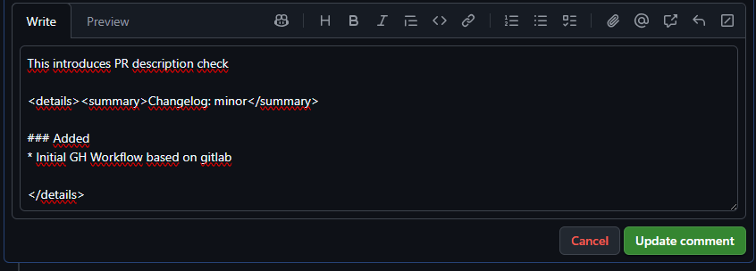
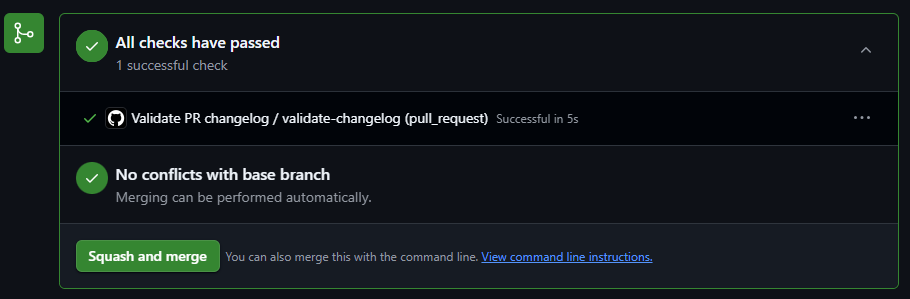
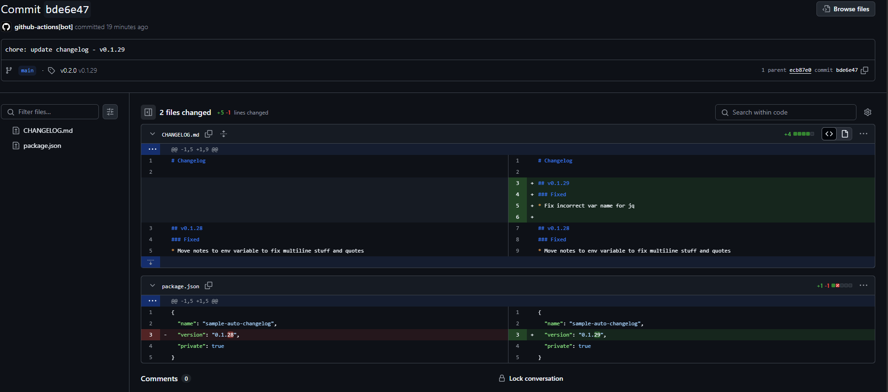
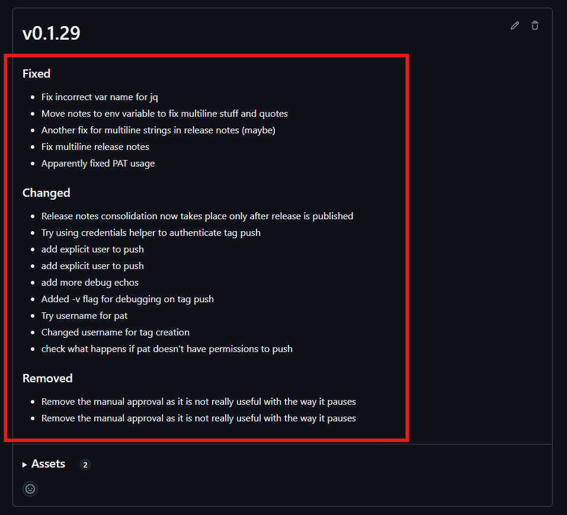
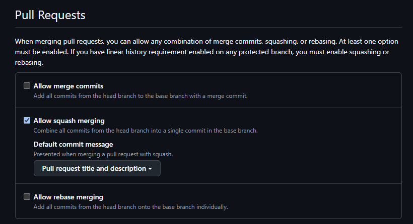

# Auto Changelog Workflow

This repository uses an automated changelog management system that helps maintain consistent changelog entries and automates version bumping based on semantic versioning.

**Disclaimer:** This workflow is in early stages of development. It is simple, but not very flexible yet. It goes without saying, that any contributions are welcome!

[Skip to Project Setup Instructions ➡](#project-setup-instructions)

## How It Works

The workflow automatically manages changelog entries through pull requests and releases.

### Adding Changelog Entries

This workflow supports 3 main extraction methods from PR description: **Command syntax**, **Markdown syntax**, and **Collapsible syntax**. In Command and markdown syntax variants, endint is optional. All variants are **case insensitive**.

Command syntax
```markdown
/changelog [patch|minor|major]

### Added
* features
<!-- and so on -->

/-changelog <!-- optional - if not present, we'll grab everything after command start -->
```

Markdown syntax
```markdown
## Changelog [patch|minor|major]

### Added
* features
<!-- and so on -->

--- <!-- optional - if not present, we'll grab everything after Changelog header -->
```

Collapsed `details` syntax
```markdown
<details><summary>Changelog [patch|minor|major]</summary>

### Added
* features
<!-- and so on -->

<details>
```

The change level must be one of:
- `patch`: Bug fixes and minor changes (default level if not provided)
- `minor`: New features (backwards compatible)
- `major`: Breaking changes



### Workflow Steps

1. **PR Validation**
   - Validates the changelog entry format
   - Ensures changelog notes are present
   - Checks for valid change level
   - Optionally, allows PR rejection if changelog is only a template (with `error-on-template` input)



2. **Changelog Updates**
   - When PR is merged to main, changelog entries are collected
   - Version is bumped according to semantic versioning rules
   - CHANGELOG.md and package.json are updated automatically
   - New version tag is created and pushed



3. **Release Creation**
   - When a new release is published from tag:
     - Release notes are automatically populated from the changelog since the last release
     - Previous changes are consolidated into the release notes
     - Original release description is preserved in one of two ways:
       - If `[changelog]` marker is present in description, changelog entries replace the marker
       - Otherwise, changelog entries are appended after the original description



## Best Practices

1. Always include changelog entries in your PRs
2. Use appropriate change levels based on the impact of your changes
3. Write clear, concise changelog entries that describe the changes from a user's perspective
4. One change per line in the changelog entry

## Troubleshooting

If the PR validation fails, check:
- Changelog section exists in PR description
- Change level is specified (`patch`, `minor`, or `major`)
- Changelog notes are not empty

## Project Setup Instructions

1. **Configure GitHub Repository Settings**
   - Go to repository Settings > General
   - Under "Pull Requests", enable "Allow squash merging"
   - Check "Default to pull request title and description"
   
2. **Add Local Workflow Files**
   - Create `.github/workflows` directory
   - Add the following workflow files:
      - Enforce the PR description format to match what we can detect:
      ```yaml
         # .github/workflows/validate-changelog.yml
      name: Validate PR Changelog
      
      on:
      pull_request:
         types: [opened, edited, synchronize, reopened]
      
      jobs:
      validate:
         uses: happy-changelog/happy-changelog-workflow/.github/workflows/validate-changelog.yml@v1.6.0
         permissions:
            pull-requests: read
            contents: read
         with:
            changelog-file: CHANGELOG.md
            # Optional: Reject PR if description contains template text
            error-on-template: 'Changelog: patch|minor|major'
            # Optional: Run custom script after version update
            post-version-script: |
              # Example: Update workflow references in documentation
              # This script updates version references in README.md when a new version is released
              REFERENCE_TO_UPDATE=happy-changelog/happy-changelog-workflow/.github/workflows/update-changelog.yml
              sed -i "s|${REFERENCE_TO_UPDATE}@[a-zA-Z0-9._-]*|${REFERENCE_TO_UPDATE}@v${NEW_VERSION}|g" README.md
              git add README.md
      ```
      - Update changelog and `package.json` after merge/commit into `main`
      ```yaml
         # .github/workflows/update-changelog.yml
      name: Update Changelog
      
      on:
      push:
         branches:
            - main
      
      jobs:
      update:
         uses: happy-changelog/happy-changelog-workflow/.github/workflows/update-changelog.yml@v1.6.0
         permissions:
            contents: write
         with:
            changelog-file: CHANGELOG.md
            enable-npm-version: true
            target-branch: main
            version-title-template: 'v:{version} - {date}'
            # Optional: Run custom script after version update
            post-version-script: |
              # Example: Update workflow references in documentation
              # This script updates version references in README.md when a new version is released
              REFERENCE_TO_UPDATE=happy-changelog/happy-changelog-workflow/.github/workflows/update-changelog.yml
              sed -i "s|${REFERENCE_TO_UPDATE}@[a-zA-Z0-9._-]*|${REFERENCE_TO_UPDATE}@v${NEW_VERSION}|g" README.md
              git add README.md
      ```
      - After publishing a release, update it's description, to contain changelog since previous release
      ```yaml
         # .github/workflows/edit-release.yml
      name: Edit Release Notes
      
      on:
      release:
         types: [published]
      
      jobs:
      release:
         uses: happy-changelog/happy-changelog-workflow/.github/workflows/edit-release.yml@v1.6.0
         permissions:
            contents: write
         with:
            changelog-file: CHANGELOG.md
      ```

3. **Configure Branch Protection**
   - Go to Settings > Branches
   - Add rule for `main` branch
   - Enable "Require status checks to pass"
   - Add "check-pr-description" to required checks
   - Enable "Require squash merging"

4. **Initialize Files**
   - Create `CHANGELOG.md` in repository root and add last known version inside (optional: for fresh projects the file will be initialized for you)
   - Ensure `package.json` exists with version field (for npm packages)



## Important Merge Process
When merging PRs:
- Always use squash merge
- The squash commit message must include the PR description to preserve changelog entries
- The workflow will automatically extract changelog content from the commit message

## Reverting a Release

If you need to revert a release, follow these steps:

1. **Remove the Release**
   Delete the GitHub release through UI or API
   
2. **Remove the Tag**
   ```bash
   git tag -d v1.2.3          # Delete local tag
   git push --delete origin v1.2.3  # Delete remote tag
   ```

3. **Revert Changelog Changes**
   - Edit `CHANGELOG.md`
   - Remove the version entry you want to revert

4. **Push Required Fixes**
   - Create a new PR (or commit to main if you dare) with necessary fixes and reverts in changelog file
   - After mergin, your release will already contain the previous changelog changes
   - This is crucial because:
     - The workflow automatically creates tags on commits to the default branch
     - Without fixes, the next commit would recreate the same problematic release
     - Always pair changelog reverts with actual code fixes

> ⚠️ **WARNING:** Do not push the changelog revert to the default branch without including the necessary fixes. Depeding on your setup, the automation might create a new tag immediately upon commit, potentially recreating the same problematic release. Always ensure your fixes are ready before pushing the revert.

## Workflow Inputs

### validate-changelog.yml
| Input | Description | Required | Default |
|-------|-------------|----------|---------|
| `changelog-file` | Path to the changelog file | No | `CHANGELOG.md` |
| `error-on-template` | Error message when provided MR template string is found in the description | No | `''` |
| `post-version-script` | Bash script to execute after version update but before changes are committed | No | `''` |
| `run-post-version-script-in-pr` | Whether to run post-version-script in PR validation job to preview changes | No | `true` |

### update-changelog.yml
| Input | Description | Required | Default |
|-------|-------------|----------|---------|
| `changelog-file` | Path to the changelog file | No | `CHANGELOG.md` |
| `enable-npm-version` | Update version in package.json | No | `true` |
| `target-branch` | Branch to update changelog on | No | `main` |
| `version-title-template` | Template for version title (supports {version} and {date}) | No | `'v:{version} - {date}'` |
| `post-version-script` | Bash script to execute after version update but before changes are committed | No | `''` |

### edit-release.yml
| Input | Description | Required | Default |
|-------|-------------|----------|---------|
| `changelog-file` | Path to the changelog file | No | `CHANGELOG.md` |
| `changelog-browser-url` | URL to the changelog browser | No | `https://rgembalik.gitlab.io/changelog-browser/` |
| `changelog-browser-url-type` | Type of URL to use for changelog browser (`default_branch`, `commit`, or `tag`) | No | `default_branch` |

### Available Variables
Post version script has access to these variables:
- `$NEW_VERSION` - new semantic version
- `$NEW_VERSION_CHANGES` - changelog content for this version
- `$CHANGE_LEVEL` - change level (`patch`/`minor`/`major`)
- `$CHANGELOG_FILE` - path to changelog file
